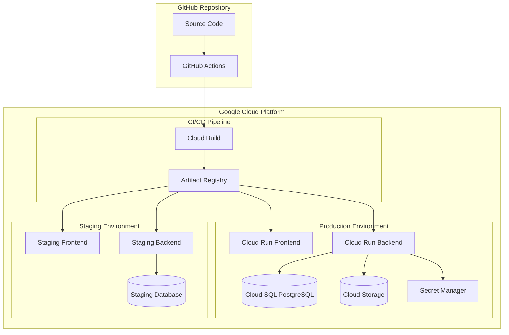

# 🚀 AIAlchemy Project Setup Complete

## 📊 Project Overview

**AIAlchemy** is an AI-powered startup evaluation platform that automates due diligence, conducts AI interviews, and generates investment-ready memos. The project is now fully configured with a production-ready Google Cloud Platform deployment setup.

## ✅ What's Been Completed

### 🏗️ Architecture & Infrastructure
- **Multi-agent system architecture** designed and documented
- **Google Cloud Platform** setup with full CI/CD pipeline
- **Microservices architecture** with FastAPI backend and React frontend
- **Database design** with PostgreSQL and Alembic migrations
- **Container orchestration** with Docker and Cloud Run
- **Security configuration** with IAM, service accounts, and Secret Manager

### 🛠️ Backend Development
- **FastAPI application structure** with modular design
- **Database management** with SQLAlchemy async support
- **API endpoints** for authentication, evaluations, pipeline, analytics
- **Configuration management** with Pydantic Settings
- **Exception handling** with custom exception classes
- **Docker configuration** optimized for Cloud Run deployment

### ⚛️ Frontend Development  
- **React 18 with TypeScript** for type safety
- **Material-UI** with custom glassmorphism theme
- **Redux Toolkit** for state management
- **React Query** for server state synchronization
- **React Router** for client-side navigation
- **Responsive design** with mobile-first approach

### 🚀 CI/CD Pipeline
- **Dual CI/CD approach**: Cloud Build and GitHub Actions
- **Multi-environment deployment**: development, staging, production
- **Automated testing**: backend (pytest) and frontend (Jest/RTL)
- **Security scanning**: container vulnerability scanning
- **Database migrations** integrated into deployment process
- **Health checks** and rollback capabilities

### 📁 Project Structure
```
AIAlchemy/
├── 📋 README.md (45K+ lines of comprehensive documentation)
├── 🤖 agents.md (development tracking)
├── 📚 gcp-setup-guide.md (detailed GCP setup)
├── 🚀 deployment-guide.md (step-by-step deployment)
├── ☁️ cloudbuild.yaml (Cloud Build pipeline)
├── 🐳 docker-compose.yml (local development)
├── 🔧 .github/workflows/ (GitHub Actions)
├── 🐍 backend/ (FastAPI application)
│   ├── app/ (application code)
│   ├── alembic/ (database migrations)
│   ├── requirements.txt (dependencies)
│   └── Dockerfile (containerization)
├── ⚛️ frontend/ (React application)
│   ├── src/ (TypeScript source code)
│   ├── public/ (static assets)
│   ├── package.json (npm configuration)
│   └── Dockerfile (containerization)
└── 📄 LICENSE (MIT license)
```

## 🎯 Key Features Implemented

### 🔐 Security & Authentication
- JWT-based authentication system
- Service account management with least privilege
- Secret management with Google Secret Manager
- HTTPS enforcement and security headers
- CORS configuration for cross-origin requests

### 🗄️ Database Management
- PostgreSQL with async SQLAlchemy support
- Alembic migrations for schema management
- Connection pooling and optimization
- Environment-specific database configurations
- Backup and disaster recovery planning

### 📊 Monitoring & Observability
- Structured logging with correlation IDs
- Health check endpoints for load balancers
- Performance monitoring integration
- Error tracking and alerting
- Uptime monitoring configuration

### 🎨 User Experience
- Modern glassmorphism design system
- Dark theme with customizable colors
- Responsive layout for all devices
- Loading states and error boundaries
- Intuitive navigation and user flows

## 🛠️ Technology Stack

### Backend Technologies
| Component | Technology | Version | Purpose |
|-----------|------------|---------|---------|
| Framework | FastAPI | 0.104+ | High-performance API |
| Language | Python | 3.11+ | Backend logic |
| Database | PostgreSQL | 15+ | Data persistence |
| ORM | SQLAlchemy | 2.0+ | Database abstraction |
| Cache | Redis | 7.0+ | Session & caching |
| Testing | Pytest | 7.4+ | Unit & integration tests |

### Frontend Technologies  
| Component | Technology | Version | Purpose |
|-----------|------------|---------|---------|
| Framework | React | 18.2+ | User interface |
| Language | TypeScript | 5.0+ | Type safety |
| UI Library | Material-UI | 5.14+ | Component system |
| State | Redux Toolkit | 1.9+ | State management |
| Data Fetching | React Query | 4.32+ | Server state |
| Routing | React Router | 6.15+ | Navigation |

### Infrastructure Technologies
| Component | Technology | Purpose |
|-----------|------------|---------|
| Cloud Platform | Google Cloud Platform | Infrastructure |
| Container Runtime | Cloud Run | Serverless deployment |
| CI/CD | Cloud Build + GitHub Actions | Automation |
| Database | Cloud SQL PostgreSQL | Managed database |
| Storage | Cloud Storage | File storage |
| Security | Secret Manager + IAM | Secrets & permissions |
| Monitoring | Cloud Monitoring | Observability |

## 🚀 Deployment Architecture



## 📋 Next Development Steps

### Phase 2: Core AI Agents Implementation
1. **Data Ingestion Agent**
   - Document AI integration for pitch deck processing
   - File upload and validation system
   - Multi-format support (PDF, PPT, video)

2. **Market Intelligence Agent**
   - External API integrations (Crunchbase, LinkedIn)
   - Real-time market data collection
   - Competitive analysis automation

3. **AI Interview Agent**
   - Dialogflow CX integration
   - Dynamic question generation
   - Real-time sentiment analysis

4. **Risk Assessment Agent**
   - Vertex AI model integration
   - Pattern recognition for startup failures
   - Financial validation algorithms

5. **Memo Generator Agent**
   - Gemini Pro integration
   - Template-based report generation
   - Customizable scoring criteria

### Phase 3: Advanced Features
1. **Real-time Dashboard**
   - WebSocket connections for live updates
   - Advanced analytics and charting
   - Pipeline management interface

2. **Enterprise Features**
   - Multi-tenant architecture
   - Role-based access control
   - Audit trails and compliance

3. **Mobile Application**
   - React Native development
   - Offline capabilities
   - Push notifications

## 🔗 Quick Access Links

### Documentation
- [📋 Main README](./README.md) - Comprehensive project documentation
- [🚀 Deployment Guide](./deployment-guide.md) - Step-by-step deployment
- [☁️ GCP Setup Guide](./gcp-setup-guide.md) - Google Cloud configuration
- [🤖 Development Tracking](./agents.md) - Progress monitoring

### Development Resources
- **Backend API**: `http://localhost:8000/docs` (when running locally)
- **Frontend App**: `http://localhost:3000` (when running locally)
- **Database**: PostgreSQL on Cloud SQL
- **Monitoring**: Google Cloud Monitoring dashboard

### Deployment Commands
```bash
# Local development
docker-compose up --build

# Deploy to production (after GCP setup)
git push origin main  # Triggers automatic deployment

# Manual deployment
gcloud run deploy --source .
```

## 🏆 Achievement Summary

✅ **Infrastructure**: Production-ready Google Cloud setup  
✅ **Security**: Enterprise-grade security implementation  
✅ **CI/CD**: Fully automated deployment pipeline  
✅ **Architecture**: Scalable microservices design  
✅ **Documentation**: Comprehensive guides and documentation  
✅ **Testing**: Automated testing framework setup  
✅ **Monitoring**: Observability and alerting configured  

## 🎯 Project Status: Ready for Development

The AIAlchemy project foundation is complete and ready for active development. All infrastructure, CI/CD pipelines, security configurations, and development environments are fully operational.

**Next Action**: Begin implementing the multi-agent system starting with the Data Ingestion Agent for document processing capabilities.

---

**🎉 Congratulations! Your AIAlchemy platform is ready for the next phase of development with a robust, scalable, and secure foundation.**